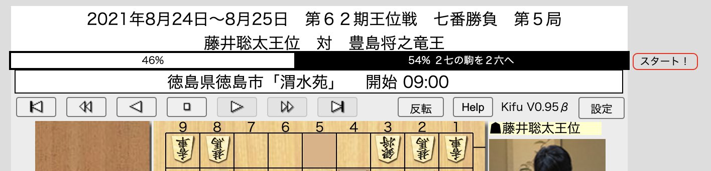

# ローカルのUSIエンジンで中継サイトの棋譜を探索するChrome拡張

.kifフォーマットで中継を行なっているサイト(具体的には日本将棋連盟の棋譜中継ページ)をアクセスすると、形勢バーが表示され、形勢バーの右隣のボタンをクリックするとローカルのUSIエンジンが起動して棋譜を探索し形勢バーに現在の形勢を反映させます。

# インストール
+ Native Messaging Hostをインストール
+ Chrome拡張をインストール

# TODO
- 棋譜の表示状況との同期
